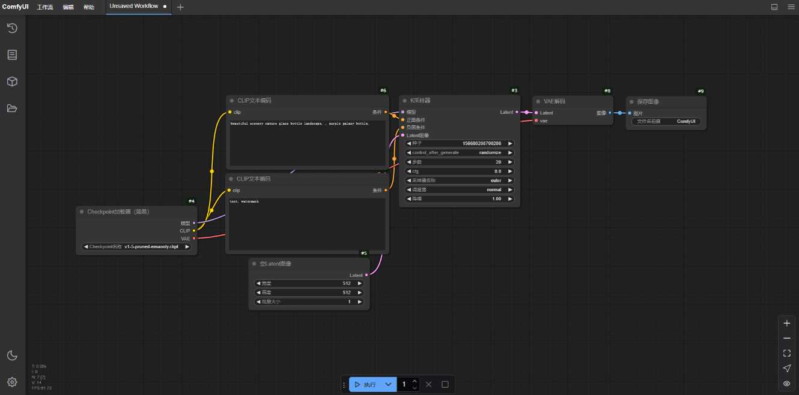

# ComfyUI In Docker

### 一、基础环境要求
- 操作系统：Ubuntu 22.04 LTS 服务器或桌面版
- CUDA: >= 12.4
- 其它: 安装docker、nvidia-docker2


### 二、构建comfyui镜像
```shell
docker build -t comfyui:v0.3.10 .
```


### 三、启动comfyui容器
#### 1、上传模型到models相关目录
#### 2、启动容器:
```shell
./run.sh
```


### 四、访问ComfyUI
http://x.x.x.x:8100



